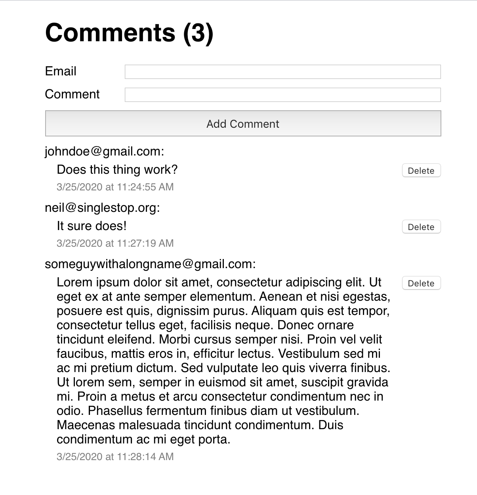

## SingleStop Frontend Developer Code Challenge

Thank you for taking the time to do our code challenge. Over the years we've been involved in many technical 
interviews — on both sides of the table.  We feel that this is a better way to evaluate your skills than whiteboarding 
or solving esoteric puzzles. Your submission will serve as the basis of your technical interview.  We will do a code review with you and ask about your submission.

The objective is to create a comments app using React, React Hooks, Redux, React-Redux Hooks and Styled Components. Please refer to the images 
in the ui-screenshots directory and the specifications outlined in this document. The styling does not need to be a 
pixel-perfect match (i.e. default font-types can differ, font-sizes can be eyeballed), but please respect the layout of the screenshot (i.e. alignment, indention)
 


 
## Feature Requirements
1. The comment count in the main heading should update when comments are added or deleted
2. The comment count should **not** display when there are zero comments.
3. When a comment is successfully submitted, the email input and comment inputs should automatically clear.
4. If the email field is left empty the comment should not submit and an error should display (see `error-sstate.png` in `ui-screenshots`)
5. If the comment field is left empty clicking the button should not trigger a submission.
6. The comments should persist if the page is reloaded. 
7. Please style the application to match the images in the ui-screenshots directory.

## What's in this project file?

The project is bootstrapped with Create React App. We've added Redux, Thunks, and Styled Components to the
package.json as well.  There is a .css file in the project but we would like you to use Styled Components.

In order to simulate working with a backend, we have provided a mock API for comments. We also added a script to 
install the dependencies for both the frontend and the API with a single command. Additionally, we tweaked the default start
script to run the frontend on port :3000 and backend on port :5000 from a single command.

## Mock Comments API
The aforementioned mock API exposes the following endpoints on port :5000
* `GET /comments`
* `POST /comments`
* `DELETE /comments/:id`

The following sample response illustrates the shape returned by a GET request to the API:
```
{
  "1584765206902": {
    "body": "Hello world",
    "email": "kevin@coolguy.com",
    "date": "3/21/2020",
    "time": "12:33:26 AM",
    "id": "1584765206902"
  },
  "1584765240234": {
    "body": "This is a comment!",
    "email": "neil@coolguy.com",
    "date": "3/21/2020",
    "time": "12:34:00 AM",
    "id": "1584765240234"
  }
}
```

The following sample payload illustrates the correct shape of a **POST** request to the comment API:
```
{
  "comment": {
    "body": "This is a comment!",
    "email": "neil@coolguy.com"
  }
}
```

The sample response payload illustrates the response shape from a **POST** request to the API:
```
{
  "body": "This is a comment!",
  "email": "neil@coolguy.com",
  "date": "3/21/2020",
  "time": "12:34:00 AM",
  "id": "1584765240234"
}
```

The following URL demonstrates a **DELETE** request:
`/comments/1584765206902`

In this scenario we are deleting a comment with the ID `1584765206902`

The response shape to the aforementioned request would look like this:
```
{id: 1584765206902}
```

### Please note the following when working with the mock API:
* The mock API stores submissions in memory but does not persist to disk. When you stop the Node.js process for the API any previously submitted comments will be gone.

## Technical Requirements
1. Please use React Hooks and React Redux Hooks.
2. The comments should be stored in Redux, not the local state of the components.
3. Please make sure that your Redux store is exposed to Redux Dev Tools
4. Please use JavaScript Standard Style.
5. Please use Styled Components.
6. Writing some tests with Jest/React Testing Library is encouraged.

## Testing
We would love to know about your experience testing React applications! If you have the time to demonstrate 
that to us now we'd love to see you write tests for this code challenge! 

 
This project was bootstrapped with [Create React App](https://github.com/facebook/create-react-app).

## Available Scripts

In the project directory, you can run:

### `yarn setup`

Installs the dependencies for the frontend (create react app) as well as the mock API backend

### `yarn start`

This will concurrently start the frontend on prt :3000 and the backend on port :5000.<br />

The page will reload if you make edits.<br />
You will also see any lint errors in the console.

### `yarn test`

Launches the test runner in the interactive watch mode.<br />
See the section about [running tests](https://facebook.github.io/create-react-app/docs/running-tests) for more information.

### `yarn build`

Builds the app for production to the `build` folder.<br />
It correctly bundles React in production mode and optimizes the build for the best performance.

The build is minified and the filenames include the hashes.<br />
Your app is ready to be deployed!

See the section about [deployment](https://facebook.github.io/create-react-app/docs/deployment) for more information.

### `yarn eject`

**Note: this is a one-way operation. Once you `eject`, you can’t go back!**

If you aren’t satisfied with the build tool and configuration choices, you can `eject` at any time. This command will remove the single build dependency from your project.

Instead, it will copy all the configuration files and the transitive dependencies (webpack, Babel, ESLint, etc) right into your project so you have full control over them. All of the commands except `eject` will still work, but they will point to the copied scripts so you can tweak them. At this point you’re on your own.

You don’t have to ever use `eject`. The curated feature set is suitable for small and middle deployments, and you shouldn’t feel obligated to use this feature. However we understand that this tool wouldn’t be useful if you couldn’t customize it when you are ready for it.

## Learn More

You can learn more in the [Create React App documentation](https://facebook.github.io/create-react-app/docs/getting-started).

To learn React, check out the [React documentation](https://reactjs.org/).

### Code Splitting

This section has moved here: https://facebook.github.io/create-react-app/docs/code-splitting

### Analyzing the Bundle Size

This section has moved here: https://facebook.github.io/create-react-app/docs/analyzing-the-bundle-size

### Making a Progressive Web App

This section has moved here: https://facebook.github.io/create-react-app/docs/making-a-progressive-web-app

### Advanced Configuration

This section has moved here: https://facebook.github.io/create-react-app/docs/advanced-configuration

### Deployment

This section has moved here: https://facebook.github.io/create-react-app/docs/deployment

### `yarn build` fails to minify

This section has moved here: https://facebook.github.io/create-react-app/docs/troubleshooting#npm-run-build-fails-to-minify
